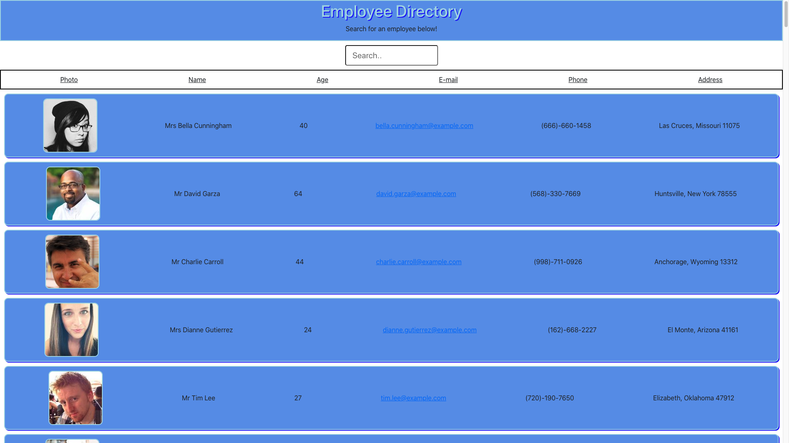

# Employee Directory
  
  ## Description
  As a user, I want to be able to view my entire employee directory at once so that I have quick access to their information.

  ## Table of Contents
  - [Description](#description)
  - [Installation](#installation)
  - [Usage](#usage)
  - [License](#license)
  - [Contributing](#contributing)
  - [Tests](#tests)
  - [Questions](#questions)

  ## Installation
  npm install, all the needed dependencies are stored in the package.json

  ## Usage
  This app uses a [Random User API](https://randomuser.me/) to generate cards that display employees in a directory. You can search for the employees by name or email.

  ## License
  N/A
  
  ## Contributing
  Beau Fortier

  ## Tests
  No tests were involved

  ## Questions
  Email me for any questions.
  
  GitHub: [beau4ta](https://github.com/beau4ta)
  
  Email me with any questions: beaufortier13@gmail.com
  
Link to deployed application:

